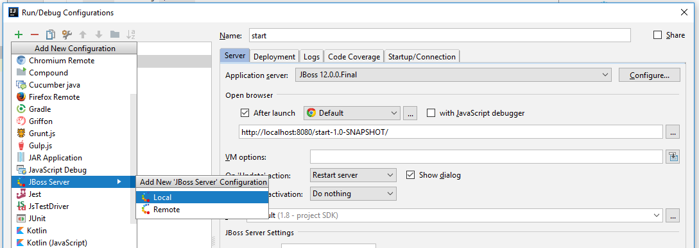

1. Wygenerować projekt z szablonu `webapp-javaee7`
1. Zmienić konfigurację uruchamiania projektu (JBoss do pobrania z: (http://wildfly.org/downloads/)[http://wildfly.org/downloads/])
   
1. W pliku HTML dodać pole `input`, typu `email`. Co zrobić, żeby puste pole wyświetlało tekst _Podaj e-mail..._?
1. Co się dzieje gdy podajemy niepoprawny adres e-mail?
